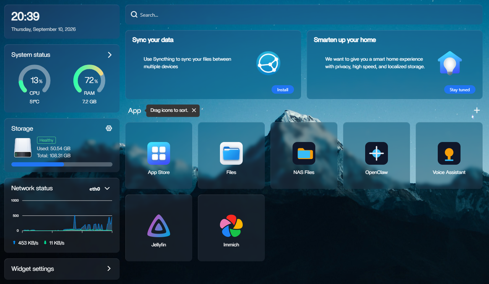

# 智能NAS系统

智能NAS系统基于Quectel Pi H1 智能主控板以CasaOS服务、OpenClaw智能体为核心，通过语音或文本下达指令，系统自动规划并调用工具，完成文件管理、相册整理、影音下载、知识问答与图片处理，带来“一句话搞定”的智能交互体验。

[English](README.md) | 中文



---

## 它能做什么

| 能力 | 说明 | 示例指令 |
|------|------|----------|
| 📁 文件管理 | 在 NAS 内移动/整理/搜索文件 | “把xxx照片移到家庭相册” |
| 🖼️ 照片分类 | 按内容自动分类归档 | “帮我把家庭相册下的照片分类” |
| 🎬 媒体下载 | 说一句话下载视频，自动进 Jellyfin 媒体库 | “下载测试视频，放到 Movies 文件夹” |
| 🔍 知识库问答 | 文档全文检索 + 照片语义搜索 | “住房合同在哪”  |
| 🎨 图片滤镜 | 一键套用复古 / 日系 / 胶片风格，输出到原目录的风格子目录，不覆盖原图，支持先预览 | “把家庭相册加复古滤镜” |
| 🗣️ 语音助手 | 系统核心入口：网页对话开箱即用，带麦克风可加唤醒词对话、离线 ASR/TTS | 使用小远同学唤醒对话 |

模型接入使用 **OpenAI 兼容接口**（DeepSeek、通义、OpenAI 等均可），只需一个 API Key。

---

## 运行环境

### 硬件

| 配件名称 | 数量 | 规格参数 |
|------|------|------|
| Quectel Pi H1 智能主控板 | 1 块 | ARM64 八核，8 GB 内存 |
| USB-C 电源适配器 | 1 个 | 27W PD，Type-C 接口，1.2 m 线长（中规） |
| Micro HDMI 线 | 1 根 | Micro HDMI 2.0，线长 1 m，HDMI-A（公）- HDMI-D（公） |
| 网线 | 1 根 | 千兆，线长 1 m |
| 显示屏 | 1 个 | 24 英寸 HDMI 显示器 |
| CPU 散热风扇 | 1 个 | 树莓派 5 代官方原装散热器（带导热贴） |
| 2PIN PH1.25 接口喇叭 | 1 个 | 2030 腔体喇叭，8 Ω 2 W 方形 |
| USB 麦克风（可选） | 1 个 | 48 kHz 高采样，360° 全指向拾音 |
| 主控板板载麦克风 | 板载 | Quectel Pi H1 板载，PulseAudio 源 `regular0` |

> **麦克风说明**：喇叭用于 TTS 语音播报，麦克风用于唤醒与语音指令。系统默认**优先使用 USB 麦克风**，USB 不可用时自动回退到**主控板板载麦克风**（同一时刻只使用一支）；两者都不可用时，网页文本模式不受影响。优先级与设备名全部由 `.env` 控制。

### 软件

| 项目 | 版本 |
|------|------|
| 操作系统 | Debian GNU/Linux 13（trixie），内核 `6.6.52` |
| 容器引擎 | Docker 29.7.2 / Docker Compose v5.5.0 |
| 应用平台 | CasaOS + OpenClaw（均以容器方式运行） |
| Python | 3.10.15 |
| 语音推理 | sherpa-onnx 1.13.7、numpy 1.24.3 |
| 音视频与音频服务 | FFmpeg 7.1.5、PulseAudio 15.0 |

### 语音模型

默认存放于 `~/voice`。

| 模型 | 用途 |
|------|------|
| SenseVoice `model.int8.onnx`（INT8） | 默认语音识别，中英双语，同时用于唤醒与指令 |
| Matcha `matcha-icefall-zh-en` | TTS 声学模型（中英双语） |
| Vocos `vocos-16khz-univ.onnx` | TTS 声码器 |
| Conformer（可选，热词） | 备用识别引擎，支持中文热词 |

> Conformer **不在默认安装流程中下载**，本机目录下若已存在属于手动启用后的遗留；仅在显式开启 `--download-conformer-model` 时才会拉取。

---

## 项目实现

### 1. 克隆项目代码

在智能主控板上打开终端，使用 git 克隆项目代码。

```bash
sudo apt update && sudo apt install -y git
git clone https://github.com/jjking619/ai-nas.git
```

执行完成后，当前目录下应生成 `NAS-Demo` 文件夹。

### 2. 执行安装脚本

在智能主控板的终端下依次执行下面命令，终端显示安装完成则说明部署完成。

```bash
cd ~/NAS-Demo
bash install.sh
```

说明：`install.sh` 可重复执行（幂等），会在保留现有服务的前提下更新模型配置。

推荐用交互式安装（默认只需输入 API Key）：

- Base URL 直接回车（默认 `https://api.deepseek.com/v1`）
- 粘贴 API Key（输入不回显）
- Model ID 默认 `deepseek-chat`

常见提供商参数：

```text
DeepSeek: base-url=https://api.deepseek.com/v1                         model-id=deepseek-v4-flash
通义千问: base-url=https://dashscope.aliyuncs.com/compatible-mode/v1   model-id=qwen-plus
OpenAI:   base-url=https://api.openai.com/v1                           model-id=gpt-4o-mini
```

如果你后续修改了 `~/NAS-Demo/.env` 里的模型配置（例如 `MODEL_BASE_URL`、`MODEL_API_KEY`、`MODEL_ID`），执行下面命令立即生效：

```bash
./oc.sh model-apply
```

如果改的是语音桥相关环境变量，保存后再执行：

```bash
sudo systemctl restart voice-bridge
```

### 3. 打开 CasaOS 控制台

在终端输入下面命令复制输出的链接到浏览器打开并注册用户：

```bash
bash ./oc.sh casaos-url
```

先在 CasaOS 应用页确认/配置其它应用（如 openclaw、Immich、Jellyfin、文件浏览、网页对话助手）。

### 4. 打开 OpenClaw 控制台并配对

在 CasaOS 上点击打开 OpenClaw 控制台。


首次可能提示自签证书风险，点“继续访问”即可；然后在终端输入中下面命令进行 approve 设备配对。

```bash
./oc.sh pair-list
./oc.sh pair-approve <request_id>
```


### 5. 登录 Immich 相册

在 CasaOS 上点击打开 Immich 控制台。

- 首次打开点击 Getting Started 按页面创建管理员账号和密码（建议邮箱用 `admin@immich.app`）
- 若直接进入登录页，请使用你已创建的管理员账号密码
- 选择语言，后面使用默认配置继续下一步即可
- 在 Immich：**Account Settings → API Keys → 新建 API Key（Select all） → Create**
- 把密钥写入 `~/NAS-Demo/.env` 文件的 `IMMICH_API_KEY` 字段

在终端输入下面命令注册 immich 工具，成功后会提醒 "Completed: Immich Finished"。

```bash
cd ~/NAS-Demo
./oc.sh tools-immich-setup
```

### 6. 首次配置 Jellyfin

在 CasaOS 上点击打开 Jellyfin 控制台。

首次向导步骤：

- 选择语言，继续下一步
- 创建管理员账号和密码
- 添加媒体库：
  - 类型「电影」→ 文件夹路径填 `/media/Movies`
  - 类型「节目」→ 文件夹路径填 `/media/TV Shows`
  - 若选择器里只能看到 `/media`、点不开子目录，回到终端执行上面提到的 `./oc.sh tools-media-setup`，然后点击文件夹列表上方的「刷新」重新浏览即可选择
- 元数据语言默认即可，完成向导

向导完成后，创建一个 API 密钥：

- 在 Jellyfin：**控制台 → 高级 → API 密钥 → 新增 API 密钥**
- 把生成的密钥写入 `~/NAS-Demo/.env` 文件中的 `JELLYFIN_API_KEY` 字段
- 输入命令验证配置是否生效：

```bash
cd ~/NAS-Demo
./oc.sh jellyfin-apply  # 一键校验 .env 与运行态是否一致、接口是否 401
```

以后 media_downloader 下载的视频放入 `~/nas_share/downloads/Movies` ，Jellyfin 会自动扫描入库。

### 7. 启用语音入口

语音/网页对话是默认交互入口，首次使用必须启用。

验证两个入口：

```bash
systemctl is-active voice-bridge          # 输出 active 即正常
curl -sS http://127.0.0.1:28082/healthz   # 返回 OK 即正常
journalctl -u voice-bridge -f             # 实时日志（对着麦克风用小远同学唤醒）
```

### 8. 试试说一句话

在语音助手中输入文本/语音进行对话（或通过唤醒词“小远同学”唤醒进行对话）：
指令示例：

```text
- 下载测试视频并播放
- 帮我把家庭相册的照片分类，先预览
- 把家庭相册下的照片加复古滤镜，先预览
- 住房合同在哪
```

> 说明：上述英文命令已在当前语音桥中验证通过；如果目录名本身是中文（例如 `测试样例`），英文回复中保留原始目录名属于正常现象，不代表语音识别失败。

---

## 日常维护

所有维护命令统一走 [oc.sh](oc.sh)（由 [install.sh](install.sh) 一键安装时自动使用）。执行 `./oc.sh` 或 `./oc.sh help` 可随时查看完整命令列表。

```bash
./oc.sh status                # 查看 openclaw 容器状态
./oc.sh logs                  # 查看 openclaw 日志（默认最近 120 行）
./oc.sh logs all 60 --level=error   # 汇总所有服务最近 60 行的错误日志
./oc.sh health                # 网关健康检查
./oc.sh url                   # 打印控制台访问地址（含 token）
./oc.sh casaos-url            # 打印 CasaOS 首页地址
./oc.sh model                 # 查看当前模型配置
./oc.sh model-apply           # 改完 .env 的模型配置后立即生效
./oc.sh deploy                # 重新部署核心服务
./oc.sh reset                 # 重置 OpenClaw 配置为出厂模板并重启
./oc.sh ui-fix                # 重新应用 CasaOS Legacy 卡片过滤
./oc.sh pair-list             # 待配对设备列表
./oc.sh pair-approve <id>     # 批准设备配对
./oc.sh mic-mode status       # 查看当前麦克风模式（.env + 运行态）
./oc.sh mic-mode usb          # 切到 USB 优先（不可用时回退板载）
./oc.sh mic-mode onboard      # 仅使用板载麦克风
./oc.sh docker-mirror         # 配置 Docker 镜像加速
./oc.sh jellyfin-apply        # 应用 Jellyfin 的 .env 配置到语音桥并校验（重启+鉴权）
```

> 语音桥是 systemd 服务，不走 `./oc.sh logs`：用 `journalctl -u voice-bridge -f` 查看实时日志。

---

## 项目结构

```text
NAS-Demo/
├── install.sh                  # 一键安装/配置入口
├── oc.sh                       # 维护命令封装
├── setup_docker_mirror.sh      # 配置 Docker 镜像加速
├── deploy.sh                   # OpenClaw 部署脚本
├── docker-compose.yml          # 核心服务全家桶编排
├── .env(.example)              # 配置（模型 API、网关 token）
├── openclaw.bootstrap.json     # OpenClaw 出厂配置模板
├── knowledge_base/             # 知识库服务
├── media_downloader/           # 媒体下载服务
├── local_voice_chat/           # 语音助手
├── voice_remote/               # 网页对话助手
├── redirect/                   # CasaOS 图标跳转层
├── casaos/                     # CasaOS 前端定制
├── assets/                     # 内置样例（界面图 / 样例文档 / 样例照片）
├── logs/                       # 运行时日志
├── ops/
│   ├── scripts/                # 运维脚本
│   └── systemd/                # systemd service/timer 与 journald 限额配置
├── filebrowser-compose.yml     # NAS 文件浏览
├── jellyfin-compose.yml        # Jellyfin
├── immich-compose.yml          # Immich
├── openclaw-compose.yml        # OpenClaw 网页入口
└── voice-assistant-compose.yml # 网页对话助手
```

---

## 常见问题

| 现象 | 处理 |
|------|------|
| CasaOS 页面里看不到 OpenClaw/Immich/Jellyfin，或点击应用打不开 | 运行 `./oc.sh openclaw-app-deploy`、`./oc.sh immich-apply`、`./oc.sh jellyfin-deploy` 重新注册应用入口 |
| `bash ./oc.sh casaos-url` 打不开 | 提示“未检测到 CasaOS Web 服务”时，执行 `curl -fsSL https://get.casaos.io \| sudo bash` 安装 CasaOS |
| Voice Assistant（28083）发消息报 502 / connection refused | 语音桥（28082）未运行。重跑 `bash install.sh` 自动安装，或手动执行 `cd ~/NAS-Demo/local_voice_chat && ./install_voice_bridge_service.sh` |
| 语音识别全单字/无反应 | systemd 缺 PulseAudio 环境。确认 `voice-bridge.service` 含 `LD_PRELOAD` + `PULSE_SERVER` 后 `sudo systemctl restart voice-bridge` |
| 想一键切换 USB/板载麦克风 | 使用 `./oc.sh mic-mode usb` 或 `./oc.sh mic-mode onboard`；当前状态用 `./oc.sh mic-mode status` |
| 语音桥安装报“找不到装有 numpy/sherpa_onnx 的 python3” | 依赖未装：`python3 -m pip install --user sherpa-onnx numpy` 后重试 |
| Voice Assistant 播放被拦（Chrome/Edge 提示 Block Audio） | 浏览器自动播放策略所致，非服务故障。点击地址栏左侧锁/权限图标 → **Permissions** → 把 **Autoplay** 改成 **Audio and Video** |
| Immich 照片搜不到 | 后台 CLIP 任务未完成：管理界面触发 Smart Search，或 `./oc.sh immich-sync-jobs` |
| 照片分类卡死 | `immich-machine-learning` 可能退出：`sudo docker start immich-machine-learning` |
| 改了 `.env` 的模型配置不生效 | 执行 `./oc.sh model-apply`（读 .env 立即应用并重启，约 10 秒） |
| 改了 `.env` 的 `JELLYFIN_API_KEY` 不生效 / 日志出现 Jellyfin 401 | 执行 `./oc.sh jellyfin-apply`（会重启语音桥并校验 .env 与运行态是否一致） |
| 安装后只有「NAS Files」成功，其它应用缺失或反复安装失败 | 多为拉取大镜像时被重置（日志 `/var/log/casaos/app-management.log` 出现 `connection reset by peer`）。执行 `./oc.sh docker-mirror` 配置镜像加速后重新安装 |

